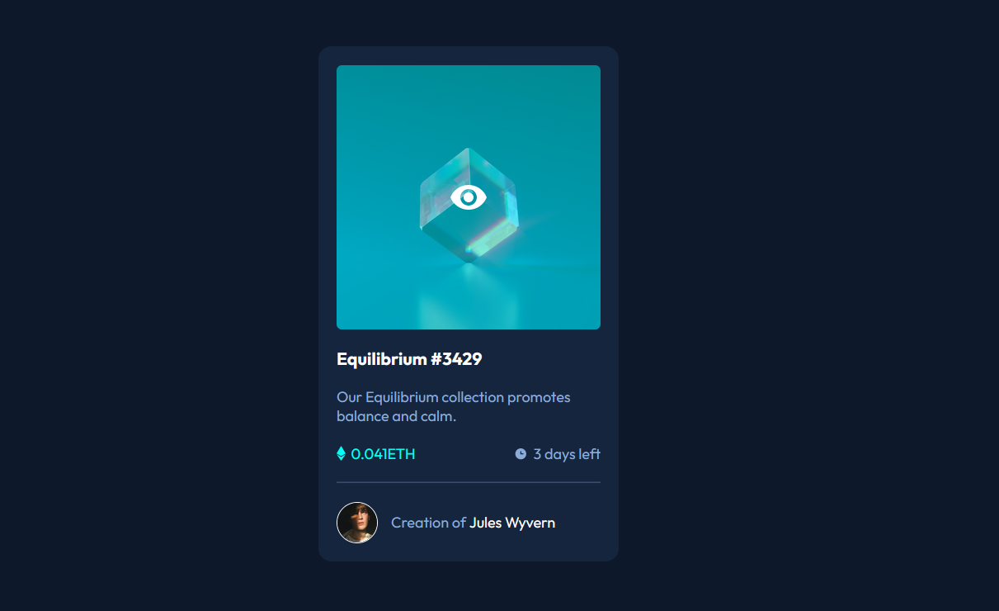
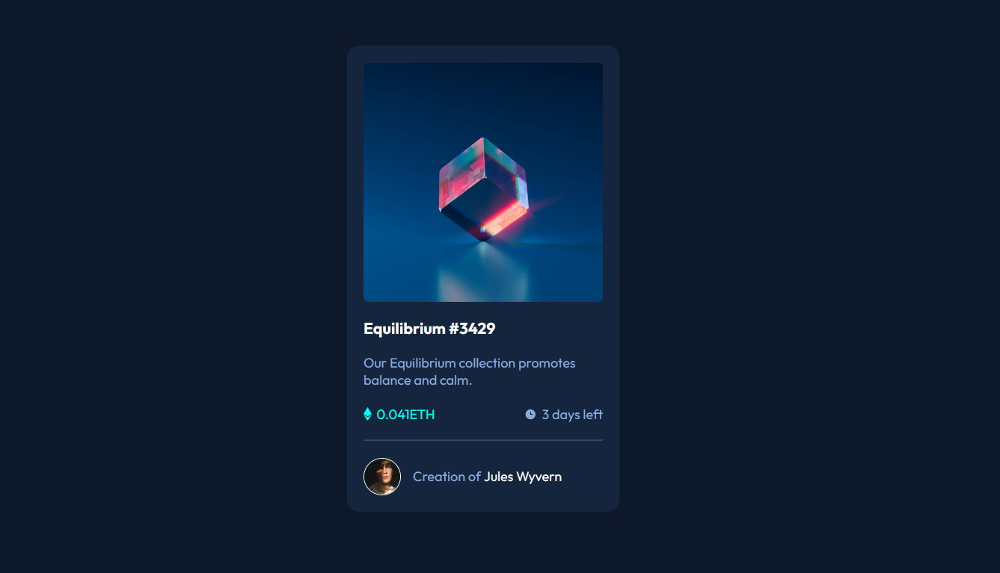

# Frontend Mentor - NFT card component solution

This is a solution to the [NFT card component challenge on Frontend Mentor](https://www.frontendmentor.io/challenges/nft-preview-card-component-SbdUL_w0U). 

## Table of contents

- [Overview](#overview)
  - [The challenge](#the-challenge)
  - [Screenshots](#screenshots)
- [What I learned](#what-i-learned)
- [Author](#author)

## Overview

### The challenge

Users should be able to:

- View the optimal layout depending on their device's screen size
- See hover states for interactive elements

### Screenshots
<p align="left">


</p>

## What I learned

In this challenge I learned about different css architectures and methodologies such as 

- [BEM](https://css-tricks.com/bem-101/)
- [CUBE CSS](https://piccalil.li/blog/cube-css)
- [SMACSS](https://smacss.com/book/)

In this small project I tried to use the BEM (Block, Element, Modifier) methodology. It was interesting, since it forced me to think more about the structure of the html and separate css actions and state more from the "static" css than usual. Overall I found it helpful in naming classes and the resulting css is - in my opinion - very well "documented" as a result and external devs should be able to understand more easily which class is responsible for which styles. I certainly will keep these css methodologies in mind and maybe try out some others as well or try them on a more complex project to see how scalable they are.


```html
<div class="card__author">
  
  <div class="card__author-name">
    Creation of
    <span class="card__author-name--highlited">Jules Wyvern</span>
  </div>
</div>
```

```css
.card__author {
  display: flex;
  align-items: center;
  gap: 1rem;
}

.card__author-img {
  width: 3rem;
  border: 1px solid white;
  border-radius: 50%;
}

.card__author-name--highlited {
  color: white;
}

.card__author-name--highlited:hover {
  color: var(--color-cyan);
  cursor: pointer;
}
```
## Author

Annalisa Comin
